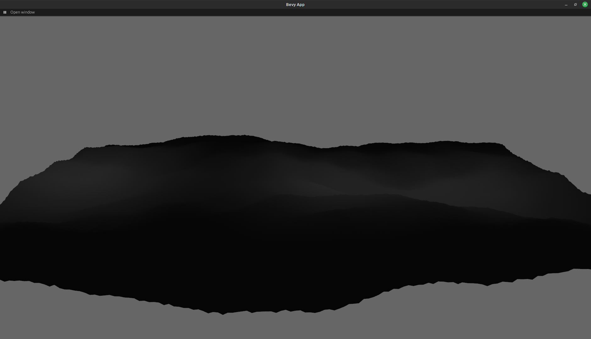
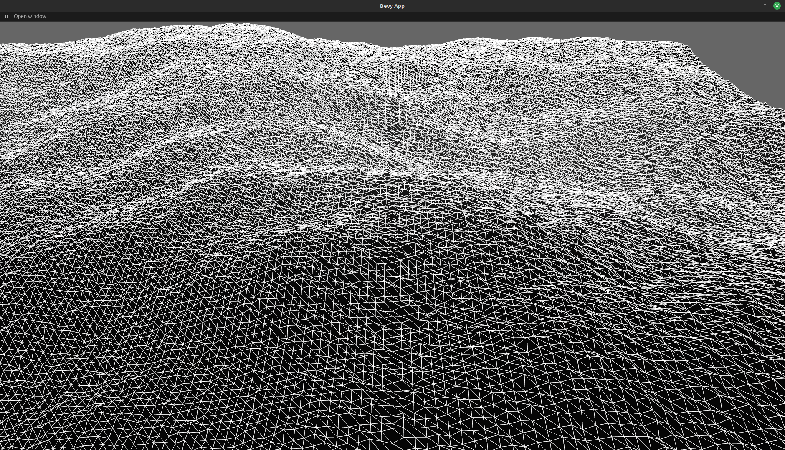

# bevy-terrain

This is an example for terrain generation in bevy.




## How it works
The `make_plane` function does the bulk of the work. In essence, it takes in a width and height, and generates a plane from them. It does this in three steps:

1. Calculate all vertices in the plane:
  -  Loop over every value between 0 and width, this becomes the points x coordinate
  -  In every iteration loop over every value between 0 and height, this becomes the points z coordinate
  -  Calculating the y coordinate is a bit more complex:
      - in order to generate a seemingly random terrain, we use noise functions. This function will return a pseudorandom value between 0 and 1. This would generate a very simple terrain.
      - To make the terrain more interesting we have layered multiple noise function over another
      - This example uses three noise functions
	      1. High frequency but low amplitude: This one is supposed to give the terrain some texture, so it seems like it has some imperfections
	      2. Median frequency and amplitude: The second function creates mid sized hills and valleys
	      3. Low frequency and high amplitude: The last function is what defines the terrain the most. Its purpose is to create big mountains and valleys in the final mesh. The other functions mostly exist, to create some imperfections in the terrain to make it look more natural
     - each functions return value is then multiplied with a scale. This allows us to control how much impact every function has on the final terrain. For example, increasing the scale of the first function would give us very spiky terrain and decreasing the value of the last function yields a very flat terrain with few mountains.
- after all this, we push the vertices into a buffer, which is then inserted into the POSITION atribute of the mesh
- We also calulate the UV coordinates of the vertex and a normal and push those onto their own respective buffers
- They get inserted into the UV and NORMAL attributes on the mesh later on as well
2. Last but not least, we have to calculate the indices for our vertices. These indices are essentially references to vertices in the vertex buffer. The index buffer describes which triangle consists of which vertices. Suppose you want to render a plane consisting of these four vertices:
```
A--B 
|\ |
| \|
C--D
```
We have two triangles here: ABD and ACD. We could describe every triangle we want to draw by creating a buffer of triangles and then pushing every vertex into that in groups of three. So this triangle buffer would look like this:
```
[A,B,D,A,C,D]
```
Since every vertex in that buffer already exists in our vertex buffer too, which would look like this [ABCD], we would store a lot of redundant data (every vertex in this triangle buffer also has to store x,y and z coordinates). Instead we store this triangle buffer by referring to the indices of the vertices in our vertex buffer, hence the name index buffer. So our triangle/index buffer would now look this:
```
[0,1,3,0,2,3]
```
This is way more space efficient and also less redundant. With our vertex buffer done, we hand it over to the mesh instance bevy does the rest for us.


